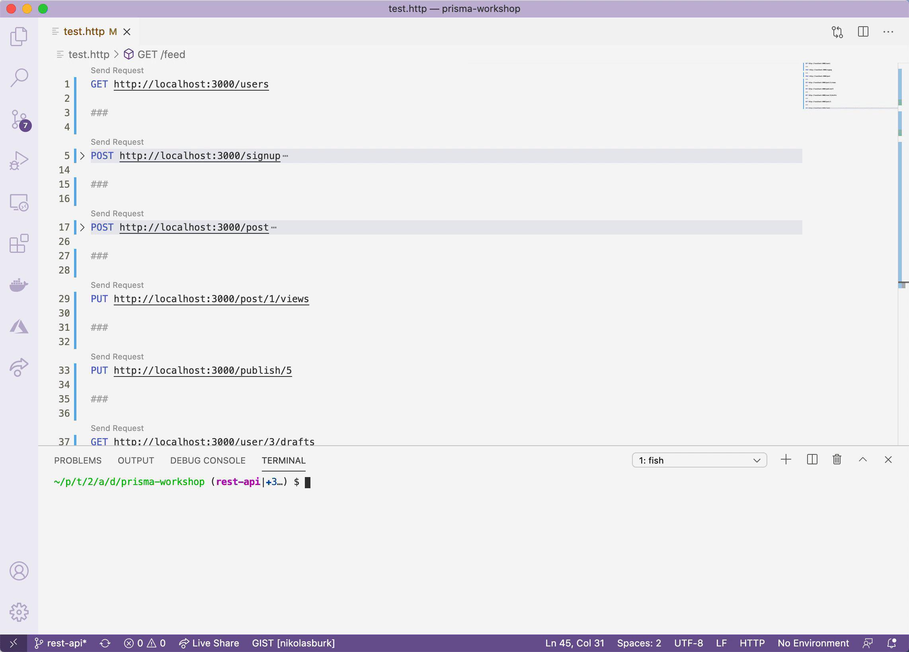

# 3. REST API

## Objectif

Le but de cette leçon est d'utiliser vos connaissances fraîchement acquises sur Prisma Client et de les utiliser pour implémenter quelques routes d'une API REST en utilisant [Express](https://expressjs.com/).

## Configuration

Vous pouvez continuer à travailler dans le même projet `prisma-workshop` que vous avez mis en place dans la leçon 1. Cependant, le starter de cette leçon est situé dans la branche `rest-api` du repo que vous avez cloné.

Avant de passer à cette branche, vous devez commiter l'état actuel de votre projet. Pour simplifier, vous pouvez utiliser la commande `git stash` pour le faire :

```bash
git stash
```

Après avoir exécuté cette commande, vous pouvez passer à la branche `rest-api` et supprimer le répertoire `migrations` et le fichier `dev.db` :

```bash
git checkout rest-api
rm -rf prisma/migrations
rm prisma/dev.db
```

Ensuite, enlevez vos dépendances npm et réinstallez-les pour tenir compte des nouvelles dépendances dans le `package.json` :

```bash
rm -rf node_modules
npm install
```

Le modèle de données que vous allez utiliser ici est très similaire à celui que vous avez créé précédemment, mais le modèle `Post` a été étendu avec quelques champs supplémentaires :

```graphql
model User {
  id    Int     @id @default(autoincrement())
  email String  @unique
  name  String?
  posts Post[]
}

model Post {
  id        Int      @id @default(autoincrement())
  **createdAt DateTime @default(now())
  updatedAt DateTime @updatedAt**
  title     String
  content   String?
  published Boolean  @default(false)
  **viewCount Int      @default(0)**
  author    User?    @relation(fields: [authorId], references: [id])
  authorId  Int?
}
```

Puisque vous recommencez votre installation de Prisma, vous devez recréer la base de données et ses tables. Exécutez la commande suivante :

```bash
npx prisma migrate dev --name init
```

Enfin, vous pouvez amorcer la base de données avec un échantillon de données qui est spécifié dans le fichier `prisma/seed.ts`. Vous pouvez exécuter ce script d'amorçage avec cette commande :

```bash
npx prisma db seed --preview-feature
```

Voilà, vous êtes prêt pour vos tâches maintenant !

## Tâches

Vous pouvez trouver les tâches pour cette leçon à l'intérieur du fichier `src/index.ts` marqué avec `TODO`. Votre objectif est d'insérer les bonnes requêtes Prisma Client pour chaque route de l'API REST.

Notez que ceci n'est *pas* une leçon sur la conception d'API et que vous devriez réfléchir plus attentivement à la conception de vos opérations d'API dans une application.

Si vous utilisez VS Code, vous pouvez installer l'extension [REST Client](https://marketplace.visualstudio.com/items?itemName=humao.rest-client) et tester votre implémentation en utilisant les appels HTTP fournis dans [`test.http`](https://github.com/nikolasburk/prisma-workshop/blob/rest-api/test.http).

- Voir une démo rapide de l'extension VS Code REST Client
    
    
    

### `GET /users`

Récupère tous les utilisateurs.

- Solution
    
    ```tsx
    app.get("/users", async (req, res) => {
      const result = await prisma.user.findMany()
      res.json(result)
    });
    ```
    

### `POST /signup`

Crée un nouvel utilisateur.

- Solution
    
    ```tsx
    app.post(`/signup`, async (req, res) => {
      const { name, email } = req.body;
    
      const result = await prisma.user.create({
        data: {
          name,
          email
        }
      })
    
      res.json(result)
    });
    ```
    

### `POST /post`

Crée un nouveau post.

- Solution
    
    ```tsx
    app.post(`/post`, async (req, res) => {
      const { title, content, authorEmail } = req.body;
    
      const result = await prisma.post.create({
        data: {
          title,
          content,
          author: {
            connect: {
              email: authorEmail
            }
          }
        }
      })
    
      res.json(result)
    });
    ```
    

### `PUT /post/:id/views`

Augmente les vues d'un post par 1.

- Solution
    
    ```tsx
    app.put("/post/:id/views", async (req, res) => {
      const { id } = req.params;
    
      const result = await prisma.post.update({
        where: {
          id: Number(id),
        },
        data: {
          viewCount: {
            increment: 1,
          },
        },
      });
    
      res.json(result);
    });
    ```
    

### `PUT /publish/:id`

Publie un post.

- Solution
    
    ```tsx
    app.put("/publish/:id", async (req, res) => {
      const { id } = req.params;
    
      const result = await prisma.post.update({
        where: { id: Number(id) },
        data: {
          published: true,
        },
      });
    
      res.json(result);
    });
    ```
    

### `GET /user/:id/drafts`

Récupère les post non publiés d'un utilisateur spécifique.

- Solution
    
    ```tsx
    app.get("/user/:id/drafts", async (req, res) => {
      const { id } = req.params;
    
      const result = await prisma.user.findUnique({
        where: { id: Number(id) },
      }).posts({
        where: {
          published: false
        }
      })
    
      res.json(result)
    });
    ```
    

### `GET /post/:id`

Récupère un post par son ID.

- Solution
    
    ```tsx
    app.get(`/post/:id`, async (req, res) => {
      const { id } = req.params;
    
      const result = await prisma.post.findUnique({
        where: { id: Number(id) },
      });
    
      res.json(result);
    });
    ```
    

### `GET /feed?searchString=<searchString>&skip=<skip>&take=<take>`

Récupère tous les post publiés et, éventuellement, les pagine et/ou les filtre en vérifiant si la chaîne de caractères apparaît dans le titre ou le contenu.

- Solution
    
    ```tsx
    app.get("/feed", async (req, res) => {
      const { searchString, skip, take } = req.query;
    
      const or = searchString ? {
        OR: [
          { title: { contains: searchString as string } },
          { content: { contains: searchString as string } },
        ],
      } : {}
    
      const result = await prisma.post.findMany({
        where: {
          published: true,
          ...or
        },
        skip: Number(skip) || undefined,
        take: Number(take) || undefined,
      });
    
      res.json(result);
    });
    ```